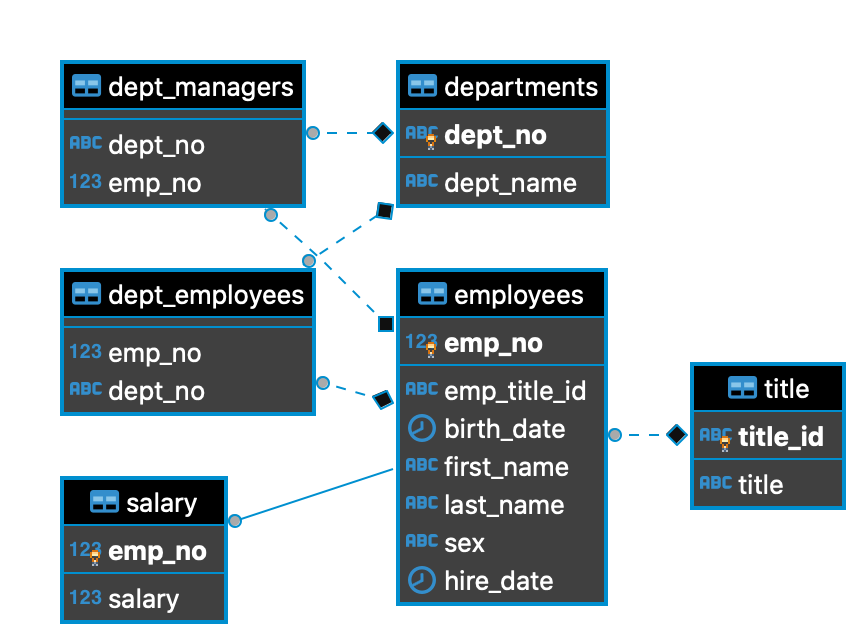
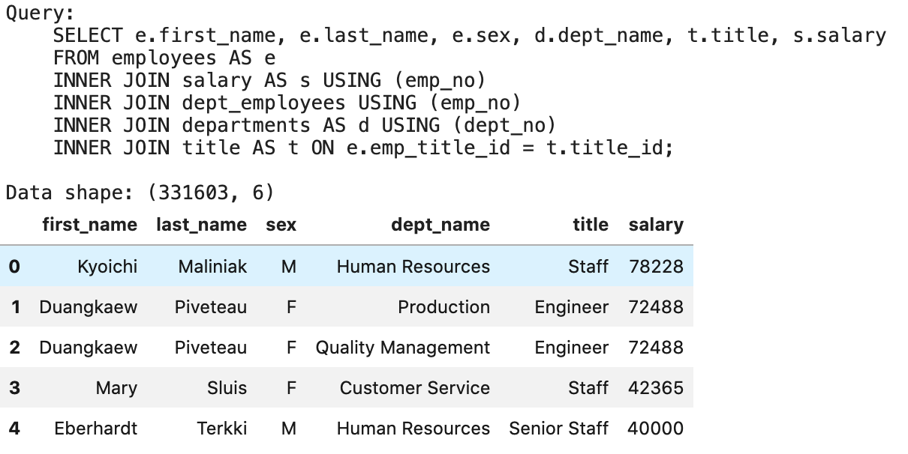
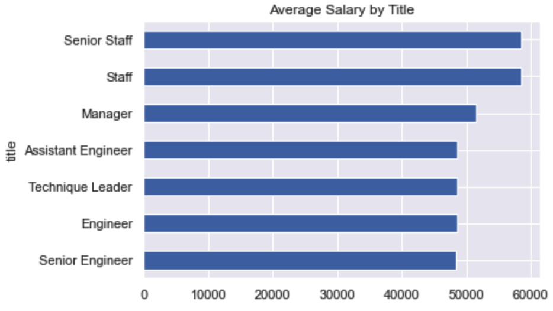

# SQL Homework - Employee Database: A Mystery in Two Parts

Data Science and Visualization Boot Camp (Northwestern University)


[](http://commonmark.org)
[](http://hits.dwyl.com/OlegRyzhkov2020/api-challenge)


## Case ERD



## Creating schema

```sql
CREATE TABLE employees(
 emp_no INTEGER PRIMARY KEY,
 emp_title_id VARCHAR(5) REFERENCES title (title_id),
 birth_date DATE,
 first_name VARCHAR,
 last_name VARCHAR,
 sex CHAR(1),
 hire_date DATE
);
```

## Data reading and exploration

```python
# Set up a connection to the postgres server.
conn_string = "host="+ creds.PGHOST +" port="+ "5432" +" dbname="+ creds.PGDATABASE +" user=" + creds.PGUSER \
+" password="+ creds.PGPASSWORD
conn=psycopg2.connect(conn_string)
print(f"PostgreSQL Database {creds.PGDATABASE} is connected!")

# Create a cursor object
cursor = conn.cursor()
```


## Data Visualization




## Contacts
[Find Me on
LinkedIn](https://www.linkedin.com/in/oleg-n-ryzhkov/)
